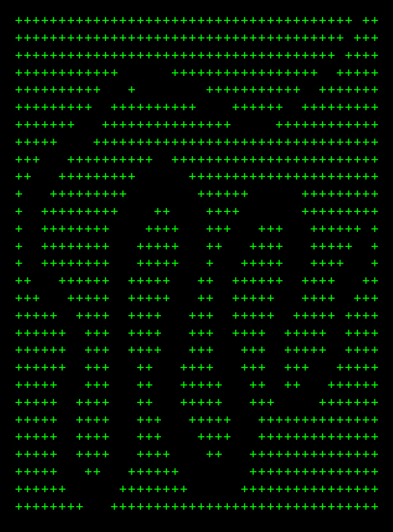

Snakepath:
C99 STB-style header-only based on [python's pathlib library](https://docs.python.org/3/library/pathlib.html), because I love pathlib.
POSIX + Windows. No malloc (OS functions like `opendir`/`stat` may allocate internally).
Vibe-coded with Claude Code + Cursor.

The original API was created by [Antoine Pitrou](https://peps.python.org/pep-0428/).

```c
u=https://raw.githubusercontent.com/netanel-haber/snakepath/main/snakepath.h &&
curl -sSLo snakepath.h "$u" &&
cat <<'EOF' | cc -xc - -o demo &&
#define SP_PATH_MAX 4096
#define SNAKEPATH_FLUENT
#define SNAKEPATH_IMPLEMENTATION
#include "snakepath.h"
#include <stdio.h>

int main(void) {
    SpPath boring = sp_path("/foo/bar.txt");
    printf("BORING API: %s\n", sp_name(&boring).buf);
    printf("BORING API: %s\n", sp_stem(&boring).buf);

    SpPath fluent = SPF("/etc")->join("nginx")->join("nginx.conf")->path();
    printf("FLUENT API: %s\n", sp_str(&fluent));
}
EOF
./demo
rm -f demo snakepath.h
```

## Build & Test

```bash
cc -o nob nob.c && ./nob
```


<details markdown="1">
<summary>Snakepath API Reference</summary>

## Boring API

### Path Creation

```c
SpPath p = sp_path("a/b/c");                    // Native flavor
SpPath p = sp_path_f("a/b/c", SP_FLAVOR_POSIX); // Explicit POSIX
SpPath p = sp_path_f("C:/x", SP_FLAVOR_WINDOWS); // Explicit Windows
```

### Path Components

```c
SpTerm name   = sp_name(&p);     // Final component: "file.txt"
SpTerm stem   = sp_stem(&p);     // Name without suffix: "file"
SpTerm suffix = sp_suffix(&p);   // Extension: ".txt"
SpTerm drive  = sp_drive(&p);    // Drive letter: "C:" (Windows)
SpTerm root   = sp_root(&p);     // Root: "/" or "\"
SpTerm anchor = sp_anchor(&p);   // Drive + root: "C:\"
// SpTerm has .buf (null-terminated) and .len fields
printf("%s\n", name.buf);        // Direct %s usage works!
```

### Navigation

```c
SpPath parent = sp_parent(&p);  // Parent directory

// Iterate parts
SpPartsIter it = sp_parts_begin(&p);
SpStr part;
while (sp_parts_next(&it, &part)) { /* use part */ }

// Iterate parents
SpParentsIter pit = sp_parents_begin(&p);
SpPath par;
while (sp_parents_next(&pit, &par)) { /* use par */ }
```

### Joining

```c
SpPath joined = sp_join_one(&p, "subdir");
SpPath joined = sp_join_n(&p, data, len);    // Join with length (preserves embedded nulls)
SpPath joined = sp_join(&p, "a", "b", "c");  // C only (variadic)
SpPath joined = sp_joinpath(&p, &other);
```

### Modification

```c
SpPath new_p = sp_with_name(&p, "newfile.txt");
SpPath new_p = sp_with_stem(&p, "newname");
SpPath new_p = sp_with_suffix(&p, ".md");
```

### Queries

```c
bool abs = sp_is_absolute(&p);
bool rel = sp_is_relative_to(&p, &base);
SpPath relative = sp_relative_to(&p, &base);
bool eq = sp_path_eq(&a, &b);
```

### Glob / Directory Traversal

```c
// Iterator-based API
SpGlobIter it = sp_glob_begin(&base, "*.txt", SP_CASE_PLATFORM_DEFAULT);
SpPath match;
while (sp_glob_next(&it, &match)) { /* use match */ }
sp_glob_end(&it);

// Recursive glob (prepends **/)
SpGlobIter it = sp_rglob_begin(&base, "*.c", SP_CASE_PLATFORM_DEFAULT);

// Convenient foreach macros
SP_GLOB_FOREACH(&base, "*.txt", match) { /* use match */ }
SP_RGLOB_FOREACH(&base, "*.c", match) { /* use match */ }
```

### Walk (Directory Tree Traversal)

```c
// Callback-based walk - allocation-free, unlimited depth via stack recursion
bool my_callback(struct SpWalkEntry *e) {
    printf("%s: %zu dirs, %zu files\n",
           sp_str(&e->dirpath), e->dirname_count, e->filename_count);
    return true;  // continue walking
}
SpPath dir = sp_path("src");
sp_walk(&dir, true, false, my_callback, NULL, NULL);
```

## Fluent API

Enable with `#define SNAKEPATH_FLUENT` before including.

```c
#define SP_PATH_MAX 4096
#define SNAKEPATH_FLUENT
#define SNAKEPATH_IMPLEMENTATION
#include "snakepath.h"

// Path('a/b/c').parent.name -> "b"
SpTerm name = SPF("a/b/c")->parent()->name();

// PurePosixPath('/etc').joinpath('init.d', 'apache2') -> PurePosixPath('/etc/init.d/apache2')
SpPath p = SPF_P("/etc")->join("init.d")->join("apache2")->path();

SpPath w = SPF_W("C:/Users")->join("docs")->path();
SpPath child = sp_join_one(&p, "file.txt");
```

### Macros

| Macro | Python |
|-------|--------|
| `SPF("path")` | `Path('path')` |
| `SPF_P("path")` | `PurePosixPath('path')` |
| `SPF_W("path")` | `PureWindowsPath('path')` |
| `SPF_PATH(p)` | Start fluent chain from existing `SpPath` |

### Chainable

`->parent()` `->join("x")` `->with_name("x")` `->with_stem("x")` `->with_suffix(".x")` `->absolute()` `->expanduser()` `->relative_to(&p)` `->relative_to_walk_up(&p)`

### Terminators

| Method | Returns |
|--------|---------|
| `->path()` | `SpPath` |
| `->name()` `->stem()` `->suffix()` | `SpTerm` |
| `->drive()` `->root()` `->anchor()` | `SpTerm` |
| `->owner()` `->group()` | `SpTerm` |
| `->suffixes()` | `SpSuffixes` |
| `->is_absolute()` | `bool` |
| `->is_relative_to(&p)` | `bool` |
| `->is_file()` `->is_dir()` `->exists()` | `bool` |
| `->is_symlink()` `->is_mount()` `->is_junction()` | `bool` |
| `->is_block_device()` `->is_char_device()` | `bool` |
| `->is_fifo()` `->is_socket()` | `bool` |
| `->read_file(buf, size)` | `SpIOResult` |
| `->write_file(data, len)` | `SpIOResult` |

## Core Types

```c
SpStr       { const char *data; size_t len; }        // String view (non-owning)
SpTerm      { char buf[256]; size_t len; }           // Terminated string (owning, null-terminated)
SpPath      { char buf[4096]; size_t len; SpFlavor flavor; }
SpFlavor    { SP_FLAVOR_NATIVE, SP_FLAVOR_POSIX, SP_FLAVOR_WINDOWS }
```

**SpTerm vs SpStr:** Component functions (`name`, `stem`, `suffix`, `drive`, `root`, `anchor`) return `SpTerm` which owns its data and is null-terminated, allowing direct `%s` usage. `SpStr` is a view into existing memory (used internally and for iteration).

## Configuration

Define before including:

```c
#define SP_PATH_MAX 4096      // Max path length (REQUIRED)
#define SP_MAX_SUFFIXES 16    // Max file extensions (optional, default 16)
```

**Note:** `SP_PATH_MAX` must be defined before including the header. Use `SP_PATH_MAX_LINUX` (4096) or `SP_PATH_MAX_WINDOWS` (1024) as guidance.

## Platform Behavior

| | POSIX | Windows |
|---|-------|---------|
| Separator | `/` | `\` (normalizes `/`) |
| Drive | None | `C:` or UNC `\\server\share` |
| Absolute | Has root `/` | Has drive + root `C:\` |

## Python Bindings

Thin ctypes wrapper providing `PurePath`, `PurePosixPath`, and `PureWindowsPath` classes compatible with Python's pathlib interface.

```python
from snakepath import PurePosixPath, PureWindowsPath

p = PurePosixPath('/usr/local/bin')
print(p.name)      # 'bin'
print(p.parent)    # PurePosixPath('/usr/local')
print(p.suffix)    # ''

w = PureWindowsPath('C:/Users/test.txt')
print(w.drive)     # 'C:'
print(w.stem)      # 'test'
```

### Testing

Tests run CPython's official pathlib test suite against snakepath:

```bash
python tests/python_harness/run_cpython_tests.py
```

## Gotchas

### Empty paths normalize to `"."`

Like Python's pathlib, an empty path string normalizes to `"."` (current directory):

```c
SpPath p = sp_path("");
printf("%s\n", sp_str(&p));  // prints "."
```

### `sp_suffixes()` returns all dot-separated segments

Like Python's `pathlib.Path.suffixes`, this function returns **all** segments after dots in the filename—not just "real" file extensions:

```c
SpPath p = sp_path("snakepath-1.0.0.tar.gz");
SpSuffixes s = sp_suffixes(&p);
// s.count == 4: ".0", ".0", ".tar", ".gz"
```

Use `sp_suffix()` if you only want the final extension (`.gz`).

### Parent iteration terminates at anchors

`sp_parents_count()` and parent iteration stop at the path's anchor—`/` for absolute paths, `.` for relative paths:

```c
sp_parents_count(sp_path("/a/b/c/d")) == 4  // /a/b/c, /a/b, /a, /
sp_parents_count(sp_path("a/b/c"))    == 3  // a/b, a, .
sp_parents_count(sp_path("/"))        == 0  // root has no parents
sp_parents_count(sp_path("."))        == 0  // current dir has no parents
```

## Pathlib Mapping

[PurePath docs](https://docs.python.org/3/library/pathlib.html#pure-paths) · [Path docs](https://docs.python.org/3/library/pathlib.html#concrete-paths)

| Python | Boring API | Fluent |
|--------|-----------|--------|
| [`.parts`](https://docs.python.org/3/library/pathlib.html#pathlib.PurePath.parts) | `sp_parts_begin/next()` | - |
| [`.drive`](https://docs.python.org/3/library/pathlib.html#pathlib.PurePath.drive) | `sp_drive()` | `.drive()` |
| [`.root`](https://docs.python.org/3/library/pathlib.html#pathlib.PurePath.root) | `sp_root()` | `.root()` |
| [`.anchor`](https://docs.python.org/3/library/pathlib.html#pathlib.PurePath.anchor) | `sp_anchor()` | `.anchor()` |
| [`.parents`](https://docs.python.org/3/library/pathlib.html#pathlib.PurePath.parents) | `sp_parents_begin/next()` | - |
| [`.parent`](https://docs.python.org/3/library/pathlib.html#pathlib.PurePath.parent) | `sp_parent()` | `.parent()` |
| [`.name`](https://docs.python.org/3/library/pathlib.html#pathlib.PurePath.name) | `sp_name()` | `.name()` |
| [`.suffix`](https://docs.python.org/3/library/pathlib.html#pathlib.PurePath.suffix) | `sp_suffix()` | `.suffix()` |
| [`.suffixes`](https://docs.python.org/3/library/pathlib.html#pathlib.PurePath.suffixes) | `sp_suffixes()` | `.suffixes()` |
| [`.stem`](https://docs.python.org/3/library/pathlib.html#pathlib.PurePath.stem) | `sp_stem()` | `.stem()` |
| [`.as_posix()`](https://docs.python.org/3/library/pathlib.html#pathlib.PurePath.as_posix) | `sp_as_posix()` | - |
| [`.is_absolute()`](https://docs.python.org/3/library/pathlib.html#pathlib.PurePath.is_absolute) | `sp_is_absolute()` | `.is_absolute()` |
| [`.is_relative_to()`](https://docs.python.org/3/library/pathlib.html#pathlib.PurePath.is_relative_to) | `sp_is_relative_to()` | `.is_relative_to()` |
| [`.joinpath()`](https://docs.python.org/3/library/pathlib.html#pathlib.PurePath.joinpath) | `sp_join_one()` | `.join()` |
| [`.match()`](https://docs.python.org/3/library/pathlib.html#pathlib.PurePath.match) | `sp_match()` | - |
| [`.relative_to()`](https://docs.python.org/3/library/pathlib.html#pathlib.PurePath.relative_to) | `sp_relative_to()` | `.relative_to()` |
| [`.with_name()`](https://docs.python.org/3/library/pathlib.html#pathlib.PurePath.with_name) | `sp_with_name()` | `.with_name()` |
| [`.with_stem()`](https://docs.python.org/3/library/pathlib.html#pathlib.PurePath.with_stem) | `sp_with_stem()` | `.with_stem()` |
| [`.with_suffix()`](https://docs.python.org/3/library/pathlib.html#pathlib.PurePath.with_suffix) | `sp_with_suffix()` | `.with_suffix()` |
| [`.absolute()`](https://docs.python.org/3/library/pathlib.html#pathlib.Path.absolute) | `sp_absolute()` | `.absolute()` |
| [`.as_uri()`](https://docs.python.org/3/library/pathlib.html#pathlib.Path.as_uri) | `sp_as_uri()` | - |
| [`Path.cwd()`](https://docs.python.org/3/library/pathlib.html#pathlib.Path.cwd) | `sp_cwd()` | - |
| [`Path.home()`](https://docs.python.org/3/library/pathlib.html#pathlib.Path.home) | `sp_home()` | - |
| [`.expanduser()`](https://docs.python.org/3/library/pathlib.html#pathlib.Path.expanduser) | `sp_expanduser()` | `.expanduser()` |
| [`.stat()`](https://docs.python.org/3/library/pathlib.html#pathlib.Path.stat) | `sp_stat()` | - |
| [`.lstat()`](https://docs.python.org/3/library/pathlib.html#pathlib.Path.lstat) | `sp_lstat()` | - |
| [`.exists()`](https://docs.python.org/3/library/pathlib.html#pathlib.Path.exists) | `sp_exists()` | `.exists()` |
| [`.is_file()`](https://docs.python.org/3/library/pathlib.html#pathlib.Path.is_file) | `sp_is_file()` | `.is_file()` |
| [`.is_dir()`](https://docs.python.org/3/library/pathlib.html#pathlib.Path.is_dir) | `sp_is_dir()` | `.is_dir()` |
| [`.is_symlink()`](https://docs.python.org/3/library/pathlib.html#pathlib.Path.is_symlink) | `sp_is_symlink()` | `.is_symlink()` |
| [`.is_block_device()`](https://docs.python.org/3/library/pathlib.html#pathlib.Path.is_block_device) | `sp_is_block_device()` | `.is_block_device()` |
| [`.is_char_device()`](https://docs.python.org/3/library/pathlib.html#pathlib.Path.is_char_device) | `sp_is_char_device()` | `.is_char_device()` |
| [`.is_fifo()`](https://docs.python.org/3/library/pathlib.html#pathlib.Path.is_fifo) | `sp_is_fifo()` | `.is_fifo()` |
| [`.is_socket()`](https://docs.python.org/3/library/pathlib.html#pathlib.Path.is_socket) | `sp_is_socket()` | `.is_socket()` |
| [`.is_mount()`](https://docs.python.org/3/library/pathlib.html#pathlib.Path.is_mount) | `sp_is_mount()` | `.is_mount()` |
| [`.is_junction()`](https://docs.python.org/3/library/pathlib.html#pathlib.Path.is_junction) | `sp_is_junction()` | `.is_junction()` |
| [`.samefile()`](https://docs.python.org/3/library/pathlib.html#pathlib.Path.samefile) | `sp_samefile()` | - |
| [`.readlink()`](https://docs.python.org/3/library/pathlib.html#pathlib.Path.readlink) | `sp_readlink()` | - |
| [`.resolve()`](https://docs.python.org/3/library/pathlib.html#pathlib.Path.resolve) | `sp_resolve()` | - |
| [`.glob()`](https://docs.python.org/3/library/pathlib.html#pathlib.Path.glob) | `sp_glob_begin/next/end()` | - |
| [`.rglob()`](https://docs.python.org/3/library/pathlib.html#pathlib.Path.rglob) | `sp_rglob_begin/next/end()` | - |
| [`.iterdir()`](https://docs.python.org/3/library/pathlib.html#pathlib.Path.iterdir) | `sp_iterdir_begin/next/end()` | - |
| [`.walk()`](https://docs.python.org/3/library/pathlib.html#pathlib.Path.walk) | `sp_walk()` | - |
| [`.mkdir()`](https://docs.python.org/3/library/pathlib.html#pathlib.Path.mkdir) | `sp_mkdir()` | - |
| [`.touch()`](https://docs.python.org/3/library/pathlib.html#pathlib.Path.touch) | `sp_touch()` | - |
| [`.unlink()`](https://docs.python.org/3/library/pathlib.html#pathlib.Path.unlink) | `sp_unlink()` | - |
| [`.rmdir()`](https://docs.python.org/3/library/pathlib.html#pathlib.Path.rmdir) | `sp_rmdir()` | - |
| [`.rename()`](https://docs.python.org/3/library/pathlib.html#pathlib.Path.rename) | `sp_rename()` | - |
| [`.replace()`](https://docs.python.org/3/library/pathlib.html#pathlib.Path.replace) | `sp_replace()` | - |
| [`.chmod()`](https://docs.python.org/3/library/pathlib.html#pathlib.Path.chmod) | `sp_chmod()` | - |
| [`.symlink_to()`](https://docs.python.org/3/library/pathlib.html#pathlib.Path.symlink_to) | `sp_symlink_to()` | - |
| [`.hardlink_to()`](https://docs.python.org/3/library/pathlib.html#pathlib.Path.hardlink_to) | `sp_hardlink_to()` | - |
| [`.owner()`](https://docs.python.org/3/library/pathlib.html#pathlib.Path.owner) | `sp_owner()` | `.owner()` |
| [`.group()`](https://docs.python.org/3/library/pathlib.html#pathlib.Path.group) | `sp_group()` | `.group()` |
| [`.read_bytes()`](https://docs.python.org/3/library/pathlib.html#pathlib.Path.read_bytes) | `sp_read_file()` | `.read_file()` |
| [`.read_text()`](https://docs.python.org/3/library/pathlib.html#pathlib.Path.read_text) | `sp_read_file()` | `.read_file()` + decode |
| [`.write_bytes()`](https://docs.python.org/3/library/pathlib.html#pathlib.Path.write_bytes) | `sp_write_file()` | `.write_file()` |
| [`.write_text()`](https://docs.python.org/3/library/pathlib.html#pathlib.Path.write_text) | `sp_write_file()` | `.write_file()` + encode |
| [`.open()`](https://docs.python.org/3/library/pathlib.html#pathlib.Path.open) | - | - |

</details>

<details>
<summary>MIT License</summary>
Copyright (c) 2026 Netanel Haber

Permission is hereby granted, free of charge, to any person obtaining a copy
of this software and associated documentation files (the "Software"), to deal
in the Software without restriction, including without limitation the rights
to use, copy, modify, merge, publish, distribute, sublicense, and/or sell
copies of the Software, and to permit persons to whom the Software is
furnished to do so, subject to the following conditions:

The above copyright notice and this permission notice shall be included in all
copies or substantial portions of the Software.

THE SOFTWARE IS PROVIDED "AS IS", WITHOUT WARRANTY OF ANY KIND, EXPRESS OR
IMPLIED, INCLUDING BUT NOT LIMITED TO THE WARRANTIES OF MERCHANTABILITY,
FITNESS FOR A PARTICULAR PURPOSE AND NONINFRINGEMENT. IN NO EVENT SHALL THE
AUTHORS OR COPYRIGHT HOLDERS BE LIABLE FOR ANY CLAIM, DAMAGES OR OTHER
LIABILITY, WHETHER IN AN ACTION OF CONTRACT, TORT OR OTHERWISE, ARISING FROM,
OUT OF OR IN CONNECTION WITH THE SOFTWARE OR THE USE OR OTHER DEALINGS IN THE
SOFTWARE.
</details>



